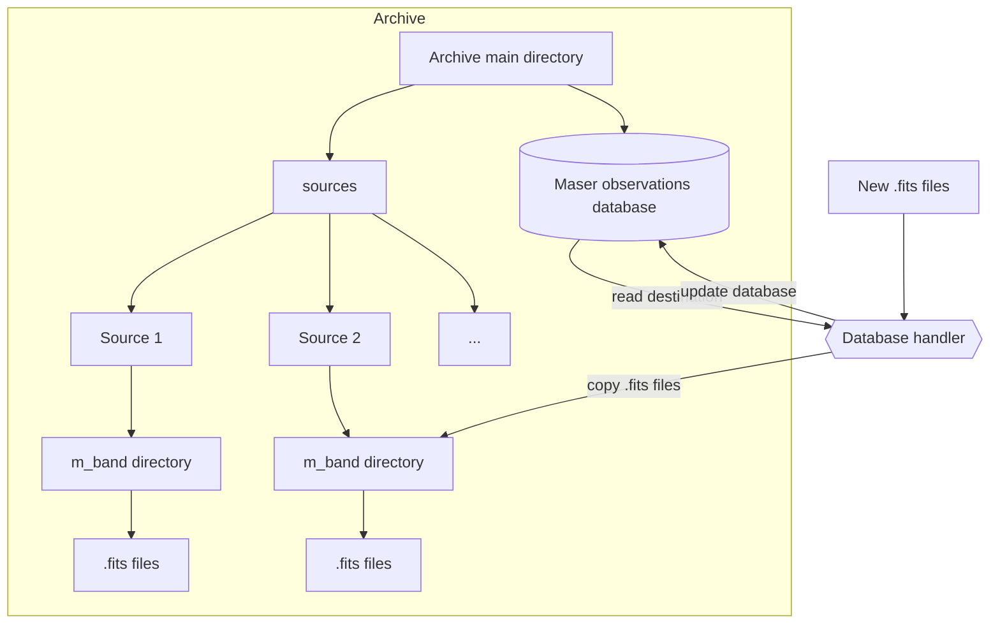

# Maser Archive database handler
## Introduction
Set of classes and functions for handling:
- maser database:
    - creating database
    - adding records
    - reading records
    - updating records
- maser archive:
    - copying .fits files

## Requirements
- astropy
- fitsio
- numpy
- pandas

### Installation
```bash
sudo apt install libbz2-dev
sudo apt install gfortran
python3 -m pip install --upgrade pip
python3 -m pip install -r requirements.txt
```


## Archive working flowchart
